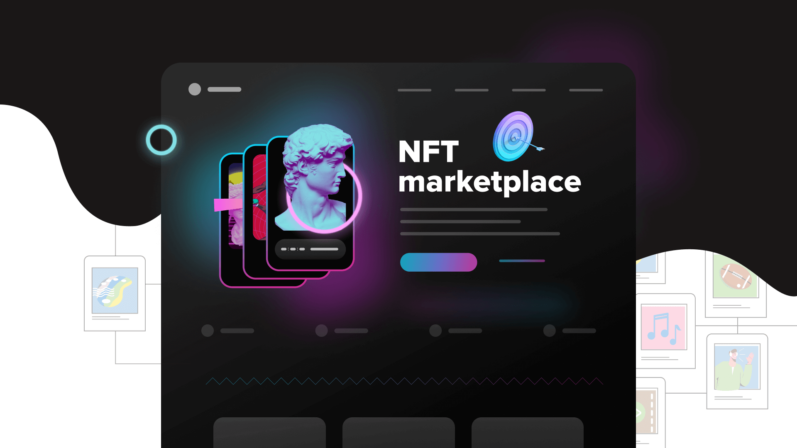

# NextJS NFT Marketplace with TheGraph


*This repo has been updated for Sepolia over Goerli.*

## 1. Git clone the contracts repo

In it's own terminal / command line, run: 

```
git clone https://github.com/Solidityarchitect/nextjs-nft-marketplace
cd nextjs-nft-marketplace
yarn
```

## 2. Deploy to sepolia 

After installing dependencies, deploy your contracts to sepolia:

```
yarn hardhat deploy --network sepolia
```

## 3. Deploy your subgraph

```
cd ..
git clone https://github.com/PatrickAlphaC/graph-nft-marketplace
cd graph-nft-marketplace
yarn
```

Follow the instructions of the [README](https://github.com/PatrickAlphaC/graph-nft-marketplace-fcc/blob/main/README.md) of that repo. 

Then, make a `.env` file and place your temporary query URL into it as `NEXT_PUBLIC_SUBGRAPH_URL`.


## 4. Start your UI

Make sure that:
- In your `networkMapping.json` you have an entry for `NftMarketplace` on the sepolia network. 
- You have a `NEXT_PUBLIC_SUBGRAPH_URL` in your `.env` file. 

```
yarn dev
```

1. Home page:
  1. Show recently listed NFTs ✅
    1. If you own the NFT, you can update the listing ✅
    2. If not, you can buy the listing ✅

2. Sell Page:
  1. You can list your NFT on the marketplace ✅
  2. And withdraw proceeds ✅

3. Instead of reading the events from Moralis, we will
  1. Index them with TheGraph 
  2. Read from the graph